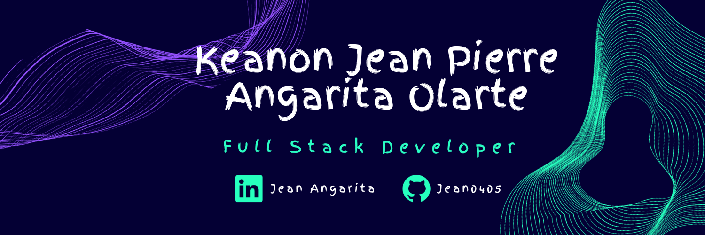

  

<h1 align="center">Hi 👋, I'm Jean</h1>

<h2 align="center" style="background-color: #00B0B2; color: white; font-weight: bolder; padding: 10px;">ABOUT ME</h2>

<h4 align="center">🌠 I am a 20yo Colombian young man who is passionate about coding and immersed in Full-Stack development. (Although my favorite is the Back End 😝)</h4>

 ⭐ My focuses are <strong>Javascript</strong>, <strong>Node.js</strong> with <strong>Express</strong> and <strong>SQL Databases</strong>.

- 🌱 I'm deepening my knowledge of **SQL Databases**

- 🗣️I'm currently learning **English**

<h3 align="center">Languages and Tools:</h3>

             

 

 <h3 align="center"> Check my streak stats and most used languagues: </h3>
    

        
    

    

        
    

